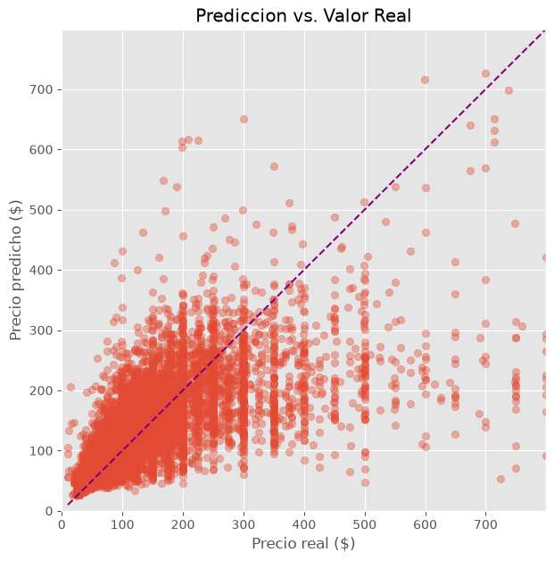

# Prediccion de precios de Airbnb en Nueva York



Proyecto enfocado en analizar los factores que influyen en el precio de los alojamientos de Airbnb en  Nueva York.

---

## Objetivo

Identificar que caracteristicas tienen mayor influencia sobre el precio de un alojamiento y comparar distintos modelos de Machine Learning para encontrar la mejor alternativa de prediccion.

---

## Dataset

Este proyecto usa el dataset **New York City Airbnb Open Data (2019)**, disponible en Kaggle:
https://www.kaggle.com/datasets/dgomonov/new-york-city-airbnb-open-data

Contiene informacion sobre aproximadamente 49.000 alojamientos publicados en Airbnb, incluyendo:

- Tipo de habitacion
- Barrio
- Ubicacion geografica
- Disponibilidad
- Cantidad de reseñas
- Noches minimas
- Precio
- etc

Para reproducir el análisis:
1. Descarga `AB_NYC_2019.csv` desde el link de arriba.
2. Colocalo en `data/raw/AB_NYC_2019.csv` dentro de este repo.

---

## Tecnologias utilizadas

- Python
- Pandas
- NumPy
- Matplotlib
- Scikit-learn
- Jupyter Notebook

---

## Metodologia

El proyecto sigue una estructura inspirada en CRISP-DM:

1. Comprension del problema
2. Limpieza de datos
3. Analisis Exploratorio (EDA)
4. Preparacion de variables
5. Modelado Predictivo
6. Evaluacion de modelos
7. Conclusiones

---

## Modelos evaluados

Se compararon distintos modelos para establecer benchmarks y seleccionar la mejor alternativa:

- Dummy Regressor
- Regresion Lineal
- Decision Tree
- Random Forest

Para la optimizacion de hiperparametros se utilizaron:

- GridSearchCV
- RandomizedSearchCV

---

## Resultados

El **Random Forest** obtuvo el mejor desempeño entre los modelos evaluados.

Las variables con mayor importancia fueron:

- Tipo de habitacion
- Barrio
- Latitud
- Longitud

Se observo que:

- Los alojamientos completos presentan los precios mas elevados.
- Manhattan concentra los precios mas altos.
- El modelo tiende a subestimar los alojamientos extremadamente caros debido a la alta dispersion de la variable objetivo.

---

## Estructura del proyecto

```
airbnb-price-analysis/
│
├── data/
│   └── raw/
│
├── notebooks/
│   └── Airbnb_Price_Analysis.ipynb
│
├── images/
│
├── README.md
│
└── requirements.txt
```

---

## Como ejecutar el proyecto

```bash
git clone https://github.com/morenastolerman/airbnb-price-analysis.git

cd airbnb-price-analysis

pip install -r requirements.txt
```
Descarga el dataset **New York City Airbnb Open Data (2019)** desde Kaggle:
https://www.kaggle.com/datasets/dgomonov/new-york-city-airbnb-open-data

Coloca el archivo `AB_NYC_2019.csv` dentro de `data/raw/`.

```bash
jupyter notebook
```
---

## Proximas mejoras

- Incorporar nuevas variables derivadas del texto.
- Utilizar tecnicas para variables de alta cardinalidad.
- Comparar con modelos de Boosting.
- Incorporar informacion adicional del alojamiento.

